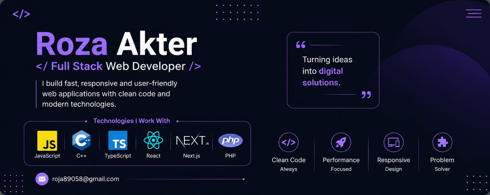

  <h1 align="center">Hi 👋, I'm Roza Akter</h1>

<h3 align="center">Full Stack Web Developer.I build modern, responsive and user-friendly web applications.</h3>

 

<h3 align="left">About Me:</h3>

  
 🎓Hii,I'm CSE Student
- 🔭 I’m currently working on **React,Next.js,MongoDB for fortend development.**
- 🍀I'm also interested in **Cyber Security.**
- 🌱 I’m currently learning **javaScript,typeScript,html,css.**
- 💻 I'm interested in **Full-stack web development.**
- 💬 Ask me about **Full-Stack(React,Next-js,mongoDB,TypeScript).**
- 📫 How to reach me **roja89058@gmail.com**

<h3 align="left">FOLLOW ME ON SOCIALS:</h3>

<h3 align="left">TECHNOLOGY STACK:</h3>

<h2 align="left">Languages</h2>

  

<h2 align="left">CSS Frameworks & Libraries</h2>

  

<h2 align="left">JavaScript Frameworks & Libraries</h2>

  

<h2 align="left">Database & Backend</h2>

  

<h2 align="left">Design & Graphics</h2>

  

<h2 align="left">Tools & Technologies</h2>

  

##  Quote

  <i>"The only way to do great work is to love what you do."</i>

